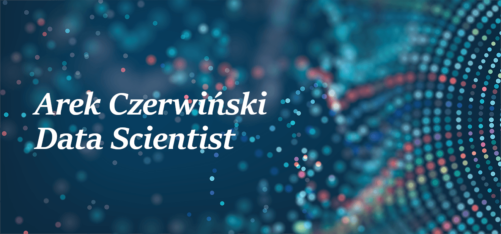

## About me 

My name is Arek and I am Data Scientist | MLDevOps working at AIUT. 

## What will you find here

After process of reorganization of repositories is finished you will be able to find here projects/tutorials concerning following technologies:

## Featured projects in progress

* [Ember framework](https://github.com/damiankucharski/Ember)

* Multidimentional visualization tool - Currently in progress

* [Hyperspectral-Analysis](https://github.com/CoInitialized/Hyperspectral-Analysis)

### Due to reactivation of this github some of the repositories will be changed to public and kaggle notebooks will be published
